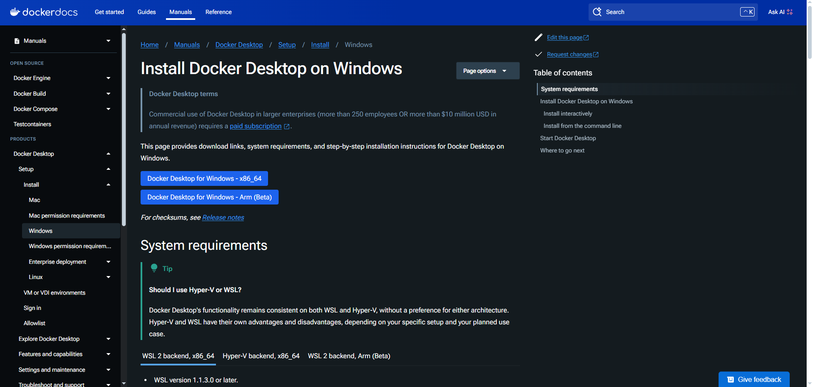
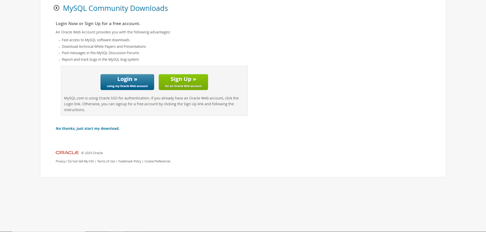
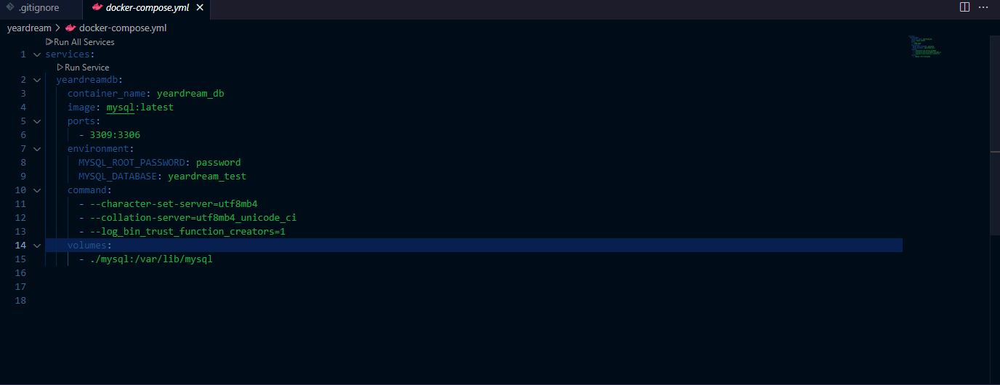
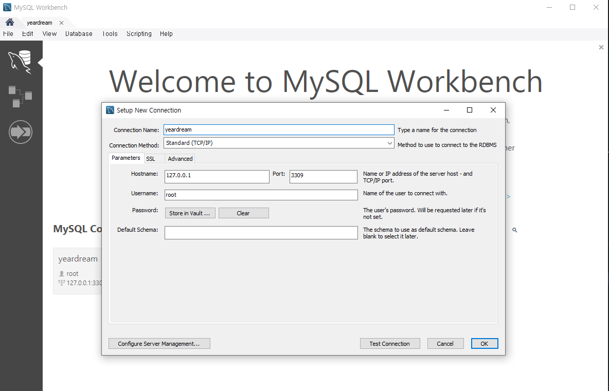
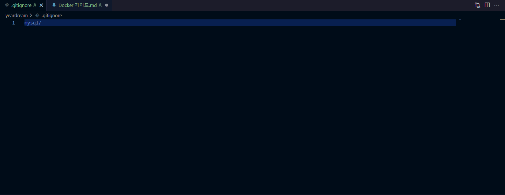

##Docker, MYSQL Workbench 설치 가이드및 에러 대처법

이어드림 오프라인 컴퓨터가 전부 같은 설정이란 가정하에 작성

https://docs.docker.com/desktop/setup/install/windows-install/
에서 "Docker Desktop for Windows - x86_64" 다운로드

설정은 바꿀 필요 없음.

Docker 열기, Personal에서 Google이나 Github으로 연결(작자는 Github)

images-> mysql 검색, 제일 위에 꺼 사용.
latest tag으로 run.
container가 열릴거임.
이제 MYSQL Workbench 설치.

##MYSQL Workbench 설치

https://dev.mysql.com/downloads/file/?id=536668
에서 "No thanks, just start my downlad" 누르기.

MYSQL Workbench 누르기
계속 Next 누르기.
Finish 누르기.
MYSQL Workbench가 열릴거임.

##Docker Container 실행및 비번 설정(VSC)

VSC extension에서 docker 설치
사용할 디렉토리에 docker-compose.yml 만들기

version: '3.8'

services:
  localdb:
    container_name: yeardream_db 
    image: mysql: latest 
    ports:
      - 3309:3306 
    environment:
      MYSQL_ROOT_PASSWORD: password 
      MYSQL_DATABASE: yeardream_test 
    command:
      - --character-set-server=utf8mb4 
      - --collation-server=utf8mb4_unicode_ci
      - --log_bin_trust_function_creators=1
    volumes:
      - ./mysql:/var/lib/mysql

입력.

VSC terminal에서 cmd 실행, docker.yml 있는 디렉토리에서

docker-compose up -d 

실행, 그럼 docker에 yeardream이란 containers가 생긴걸 볼수 있다.

##MYSQL 사용

1.VSC terminal에서 하기

docker.yml 있는 디렉토리에서 

docker exec -it yeardream_db bash
mysql -u root -p

그럼 mysql에 진입한다.

SHOW DATABASES
USE yeardream_test하고 사용하자.

2. MYSQL Workbench 사용(개인적으로 추천)

MYSQL Workbench 실행.

MYSQL Connections 에서 + 누르기.

위처럼 따라하기.
비밀번호는 위의 docker-compose.yml에서 사용한 비밀번호 입력(Store in vault 클릭)

그럼 MYSQL에 진입한다.
ERD도 그릴수 있고, 시각화가 편하다.

##주의사항

뭐가 됐든 MYSQL을 사용할때는 docker container를 꼭 실행하자.
docker-compose.yml의 MYSQL 버전과 MYSQL Workbench의 버전이 같은지 확인하자(다르면 사용에 매우 불편)

갑자기 git 숫자가 올라갔다면
docker-compose.yml과 같은 폴더에 

아니면 github가 mysql 폴더 자체를 올릴려고 한다(그리고 root로 만들었으므로 삭제하는데 관리자 권력이 필요함)

###에러(작자가 경험해본 선에서)

HCS_E_HYPERV_NOT_INSTALLED 에러

1.wsl 설치 확인
wsl -l -v
wsl --install

2.기능 켰다 끄기
제어판->Windows 기능 켜기/끄기
Hyper-V, Windows 하이퍼바이저 플랫폼, 가상 머신 플랫폼, Linux용 Windows 하위 시스템 켜기

3.BIOS로 Windows 기능 접근
컴퓨터 재시작, 시작할때 한성 로고 뜰때 'Delete'키 연타(ASUS BIOS 입장)
Advanced Mode -> Advanced -> 제일 아래에 Intel Virtualization Technology 켜기(enable)
F10 누르기(BIOS 나가기)
